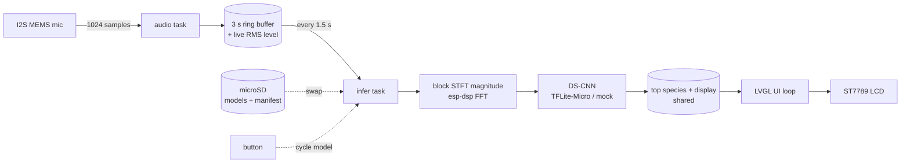

# ESP32-S3-EYE BirdNET

On-device bird-sound classification for the [ESP32-S3-EYE](https://github.com/espressif/esp-who/blob/master/docs/en/get-started/ESP32-S3-EYE_Getting_Started_Guide.md),
built with **ESP-IDF** and **TensorFlow Lite for Microcontrollers**, running a
[BirdNET](https://birdnet.cornell.edu/tools/) **DS-CNN** trained with
[birdnet-stm32](https://github.com/birdnet-team/birdnet-stm32) ("hybrid" frontend).

The board listens through its onboard I²S MEMS microphone, computes a linear
`|STFT|` magnitude spectrogram on-chip over a 3-second window, runs the model
(which embeds its own mel mixer + DS-CNN), and shows the spectrogram plus the
top species and confidence on the 1.3″ LCD.

> **Status:** the firmware ships with a **mock classifier** so the full
> pipeline (mic → features → inference → display) runs on the board immediately.
> Swap in a real trained model when ready — see [Train a real model](#train-a-real-model).
> Until then the screen clearly shows **"MOCK MODEL — not real detections"**.

---

## What runs where

| Concern | Choice |
|---|---|
| Identification | **On-device TinyML** (TFLite-Micro, ESP-NN accelerated) |
| Model | birdnet-stm32 DS-CNN, INT8, sigmoid multi-label head |
| Multi-model | **SD-backed model swap** — N experts on microSD, one resident in PSRAM, button-cycled |
| Audio | Onboard digital I²S MEMS mic, 24 kHz mono, 3 s chunks |
| Features | Linear `\|STFT\|` magnitude, 512-pt FFT → 257×256 (esp-dsp); mel mixer is **inside** the model |
| Output | LCD: spectrogram + top species + confidence + mic level + active model |
| Toolchain | Native ESP-IDF (`idf.py`) ≥ 5.4 |

Full BirdNET (6000+ species) does **not** fit on an MCU. On-device inference
targets a small custom model (tens of local species). For all-species accuracy,
run [BirdNET-Analyzer](https://github.com/birdnet-team/BirdNET-Analyzer) on a PC/Pi instead.

---

## Architecture



Source layout:

| Path | Role |
|---|---|
| [main/app_main.c](main/app_main.c) | Tasks, ring buffer, block pipeline, model swap, UI loop |
| [main/birdnet_config.h](main/birdnet_config.h) | All tunables / model contract / SD config |
| [main/audio/audio_capture.c](main/audio/audio_capture.c) | Mic capture via BSP `esp_codec_dev` |
| [main/dsp/stft_frontend.c](main/dsp/stft_frontend.c) | Block `\|STFT\|` magnitude + normalize + display |
| [main/model/birdnet_model.cc](main/model/birdnet_model.cc) | TFLite-Micro wrapper, hot swap + mock fallback |
| [main/model/model_registry.c](main/model/model_registry.c) | SD mount, manifest parser, model loader/selector |
| [main/model/model_data.cc](main/model/model_data.cc) | Embedded fallback model bytes (placeholder) |
| [main/model/labels.c](main/model/labels.c) | Dynamic species label table (loaded per model) |
| [main/ui/ui.c](main/ui/ui.c) | LVGL spectrogram + widgets |
| [tools/convert_model.py](tools/convert_model.py) | `.tflite` → C array generator |

---

## Build & flash

### Prerequisites
- **ESP-IDF ≥ 5.4** (required by the `esp32_s3_eye` BSP). The
  [VS Code ESP-IDF extension](https://github.com/espressif/vscode-esp-idf-extension)
  installs the toolchain for you.
- An ESP32-S3-EYE and a USB-A → Micro-B cable.

### Using the VS Code ESP-IDF extension
1. Open this folder in VS Code.
2. Set the target: command palette → **ESP-IDF: Set Espressif Device Target** → `esp32s3`.
3. **ESP-IDF: Build your project** (first build downloads the managed components).
4. Connect the board, pick the serial port (**ESP-IDF: Select Port**).
5. **ESP-IDF: Flash** then **ESP-IDF: Monitor**.

### Using the command line
```bash
idf.py set-target esp32s3
idf.py build
idf.py -p <PORT> flash monitor      # PORT e.g. COM5 or /dev/ttyACM0
```

> **Can't flash / board keeps rebooting?** The ESP32-S3-EYE has no USB-UART
> bridge. Enter download mode: hold **BOOT**, tap **RST**, release **RST**, then
> release **BOOT**, and flash again.

---

## Configuration

All knobs live in [main/birdnet_config.h](main/birdnet_config.h). The audio +
STFT parameters are the **contract** with the model and must match the
birdnet-stm32 training args (and the emitted `*_model_config.json`).

| Macro | Default | Meaning |
|---|---|---|
| `BIRDNET_SAMPLE_RATE_HZ` | 24000 | Mic sample rate (`--sample_rate`) |
| `BIRDNET_FFT_SIZE` | 512 | FFT / window length (`--fft_length`) |
| `BIRDNET_SPEC_WIDTH` | 256 | Time frames (`--spec_width`) |
| `BIRDNET_CHUNK_SECONDS` | 3 | Analysis window (`--chunk_duration`) |
| `BIRDNET_FFT_BINS` | 257 | STFT bins fed to the model (`FFT/2+1`) |
| `BIRDNET_STFT_HOP` | 281 | `chunk_samples / spec_width` |
| `BIRDNET_INFER_INTERVAL_MS` | 1500 | Analyze the last 3 s every N ms |
| `BIRDNET_DETECT_THRESHOLD` | 0.50 | Min score to show a species |
| `BIRDNET_TFLITE_ARENA_BYTES` | 3 MB | Tensor arena (PSRAM) |
| `BIRDNET_HAS_REAL_MODEL` | 0 | 0 = mock, 1 = embedded model |

Model input is `[1, 257, 256, 1]` float32 (or int8) linear `|STFT|` magnitude;
output is `[1, num_classes]` sigmoid scores.

---

## Train a real model

You **do not** need to record your own audio to start — the tooling pulls
labeled training data for you. This firmware targets the
[birdnet-stm32](https://github.com/birdnet-team/birdnet-stm32) DS-CNN with the
**`hybrid`** frontend. See [docs/training.md](docs/training.md) for the full
walkthrough; in short:

1. **Pick species.** Scientific names, one per line, in
   [docs/species.txt](docs/species.txt).
2. **Get data** (xeno-canto for birds, AudioSet/`noise` folders for negatives).
3. **Train with the exact contract** this firmware expects:
   ```bash
   python -m birdnet_stm32 train --data_path_train data/train \
     --audio_frontend hybrid --mag_scale pwl \
     --sample_rate 24000 --fft_length 512 --spec_width 256 \
     --chunk_duration 3 --num_mels 64 --alpha 0.5 \
     --checkpoint_path checkpoints/birdnet.keras
   ```
   (`--alpha 0.5` is recommended for the S3 — smaller/faster, no NPU here.)
4. **Convert to INT8 TFLite**, then embed:
   ```bash
   python -m birdnet_stm32 convert --checkpoint_path checkpoints/birdnet.keras \
     --model_config checkpoints/birdnet_model_config.json --data_path_train data/train
   python tools/convert_model.py checkpoints/birdnet_quantized.tflite main/model/model_data.cc
   ```
5. **Update labels** in [main/model/labels.c](main/model/labels.c) to match the
   emitted `*_labels.txt` order.
6. **Enable it:** set `BIRDNET_HAS_REAL_MODEL` to `1` in
   [main/birdnet_config.h](main/birdnet_config.h) and rebuild.

If `AllocateTensors()` reports a missing op at boot, add the corresponding
`Add*()` in [main/model/birdnet_model.cc](main/model/birdnet_model.cc).

### Alternative: capture → server
For full-species accuracy, stream/record audio and analyze it off-board with
[BirdNET-Analyzer](https://github.com/birdnet-team/BirdNET-Analyzer). That is a
different architecture than this firmware (which is standalone on-device).

---

## Multiple models on SD (model swap)

A single tiny model can only separate ~tens of species accurately. To cover
more, put **several expert models** on a microSD card — by region, season, or
bird family — and keep one resident in PSRAM at a time. **Press any board button
to cycle** to the next model; the active model name shows on the LCD.

This adds species *coverage for the device*, not capacity for one model: storage
(SD) is cheap, while the binding limits — PSRAM for one model + arena, and
per-inference compute — are unchanged because only one model is active.

### SD card layout
Format the card FAT32 and create:

```
/sdcard/models/
├── manifest.txt
├── backyard_spring.tflite
├── backyard_spring.txt
├── backyard_winter.tflite
└── backyard_winter.txt
```

### manifest.txt
A simple line-based file (no JSON — cJSON was removed from ESP-IDF v6 core).
See [docs/manifest.example.txt](docs/manifest.example.txt).

```
# Name | model.tflite | labels.txt | default
Spring  | backyard_spring.tflite | backyard_spring.txt | default
Winter  | backyard_winter.tflite | backyard_winter.txt
```

- **Name** — shown on the LCD (≤ 31 chars).
- **model** — `.tflite` filename in `/sdcard/models/`.
- **labels** — labels filename; one `Common|Scientific` per line (a line with no
  `|` is used as both). Order must match the model's class indices. May be left
  empty to keep the currently loaded labels.
- **default** — optional 4th field; `default` marks the boot model (first entry
  if omitted). Blank lines and `#` comments are ignored.

Each model must use the **same hybrid contract** (24 kHz, FFT 512, 257×256) —
see [docs/training.md](docs/training.md). Keep each `.tflite` under
`BIRDNET_MODEL_MAX_BYTES` (1.5 MB) and the largest within
`BIRDNET_TFLITE_ARENA_BYTES`; the boot log prints `arena used` and `free PSRAM`
after each load so you can tune.

> No SD card? The firmware falls back to the embedded model (if
> `BIRDNET_HAS_REAL_MODEL=1`) or the mock classifier — it still boots and runs.

---

## Hardware notes (ESP32-S3-EYE v2.2)

| Function | Detail |
|---|---|
| SoC | ESP32-S3R8, 8 MB Octal PSRAM, 8 MB flash |
| Mic | I²S MEMS: BCLK=GPIO41, WS=GPIO42, DIN=GPIO2 |
| LCD | ST7789 240×240 over SPI (LVGL) |
| microSD | SDMMC 1-bit: CLK=GPIO39, CMD=GPIO38, D0=GPIO40 |
| Audio/Display/SD | Provided by the `espressif/esp32_s3_eye` BSP |

---

## License & attribution

- BirdNET is a project of the K. Lisa Yang Center for Conservation Bioacoustics
  (Cornell Lab) and Chemnitz University of Technology. Review each BirdNET tool's
  license and terms before redistributing models or data.
- xeno-canto recordings are subject to their own
  [terms](https://xeno-canto.org/about/terms).
- This firmware depends on Espressif components (BSP, esp-tflite-micro, esp-dsp)
  under their respective licenses.
